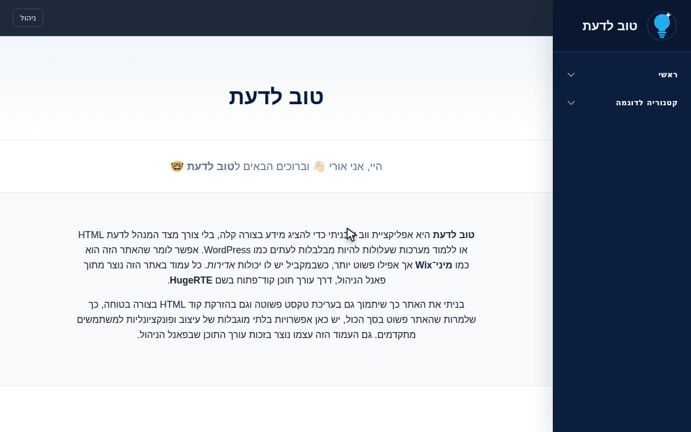

# Good2Know · טוב לדעת

*A self-service knowledge base / mini-CMS, built from scratch.*

**🔗 Live demo:** [good2know.onrender.com](https://good2know.onrender.com/)
**🛠️ Admin panel:** _same URL_ + `/management` — wide open on purpose so you could play around with it.

> Heads up: the first load can take a minute to spin up — it's hosted on Render's free tier, which spins down after 15 minutes of inactivity. Hang tight, it's worth the wait. 

The live site's content and UI are in Hebrew (RTL) — it was built for a Hebrew-speaking audience. Everything else, including this README, is in English.

## Demo

<p style="text-align:center">
  
</p>

*Homepage → admin panel → create a page → write content → save → live on the site, straight from the sidebar.*

## Why I built this

I wanted a place to publish guides and reference docs without dragging in a full CMS like WordPress, or paying for something like Wix. So I built the smallest version of that idea myself: an admin panel where you write a page with a normal rich-text editor, hit save, and it's live — no HTML knowledge required. But if you *do* want to hand-write markup or drop in a YouTube embed, you can do that too.

Everything on the live site — including the in-app guide that explains how to use the editor — was written using the tool it's describing.

## What it can do

**For visitors**
- A sidebar that's generated entirely from whatever categories and pages an admin has created — nothing hardcoded
- Any page can be set as the homepage, hidden from the sidebar (but still reachable by direct link), stretched full-width, or pointed at an external URL instead of local content
- Clean, styled rendering of the content itself, including note callouts, tables of contents, and accordions

**For admins (the fun part)**
- Create, rename, reorder, and delete categories and pages, all saved instantly
- Write content with **HugeRTE**, an open-source rich-text editor, with one-click templates for a table of contents or a "note" callout box — so a non-technical admin can build a structured guide without touching HTML
- Drop an image straight into the editor and it uploads itself, or manage every uploaded image from a dedicated media gallery
- Flip a page between full-width / contained, homepage / not, visible / hidden — all from the same screen

## A word on security

Since the editor lets admins paste in raw HTML (including iframes), I didn't want to hand out a footgun:
- Every request is validated against a schema (Valibot) before it ever touches the database
- Any HTML that gets saved is sanitized twice — once on the server, once again on the client right before it's rendered — with a matching allow-list on both sides
- Embeds are restricted to a small allow-list of hosts (YouTube, Vimeo); anything else gets stripped automatically on save

## Tech stack

| | |
|---|---|
| **Frontend** | React, TypeScript, Vite, Tailwind CSS, React Router |
| **Backend** | Bun, Hono, MongoDB |
| **Editor & safety** | HugeRTE, sanitize-html, DOMPurify, Valibot |

It's a modern MERN-alternative: Mongo and React stick around, while Bun and Hono step in for Node and Express.

## Try it yourself — the admin panel is wide open

Since this is a portfolio project, `/management` isn't locked behind a login — go create a category, write a page, throw some HTML at it, upload an image, whatever you like. (In a real production app this would obviously sit behind auth.)

The server also resets its data from a seed on every spin-up, so nothing you do can actually break it — feel free to go wild.

## Running it locally

You'll need [Bun](https://bun.sh) and a local MongoDB instance running on its default port. No `.env` file is required for local dev.

```sh
# server — http://localhost:32432
cd server
bun install
bun run dev
```

```sh
# client — http://localhost:5173 (proxies /api to the server above)
cd client
bun install
bun run dev
```

More detail in [`server/README.md`](server/README.md) and [`client/README.md`](client/README.md).

## Author

**Uri Naor**

Feel free to send me a message or connect with me on [LinkedIn](https://www.linkedin.com/in/uri-naor/)!
